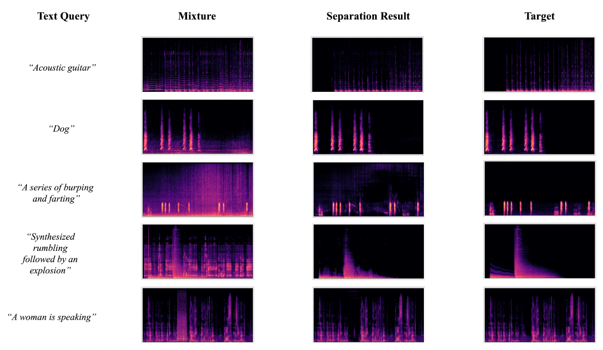

# SonicSplit: Separate Anything You Describe
We introduce SonicSplit, a foundation model for open-domain sound separation with natural language queries. SonicSplit demonstrates strong separation performance and impressive zero-shot generalization ability on numerous tasks such as audio event separation, musical instrument separation, and speech enhancement. 

  

